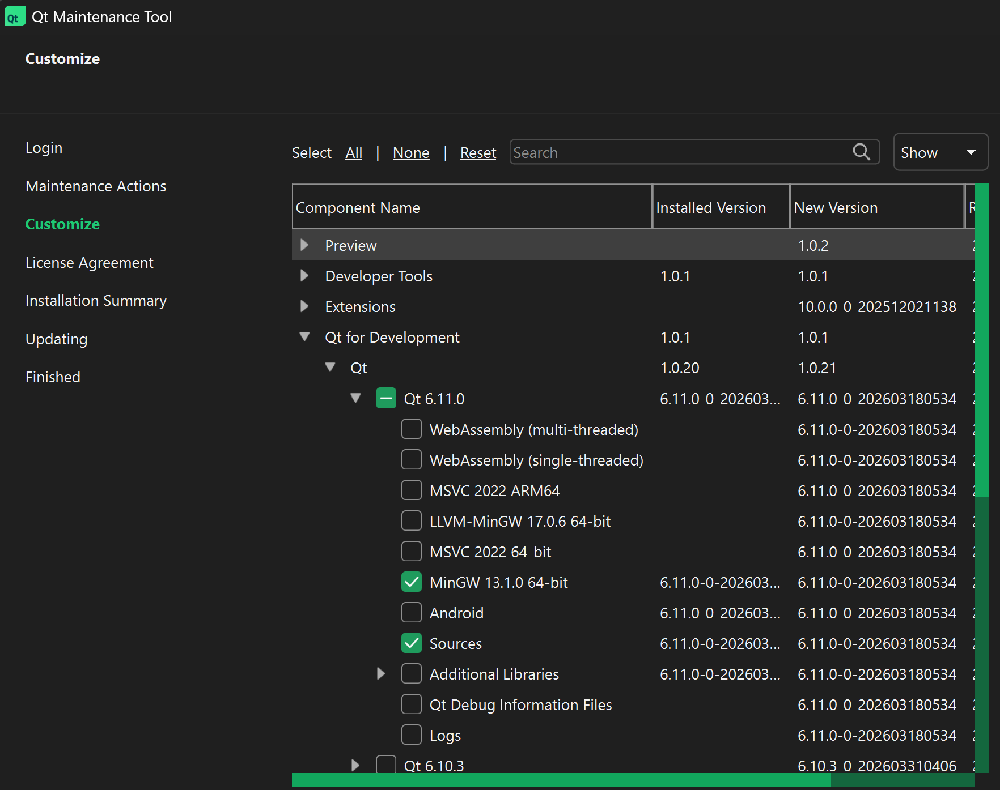
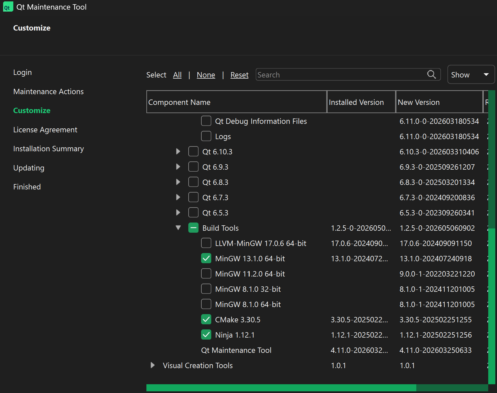
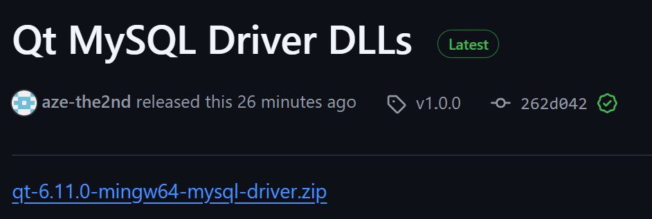

# Qt 6.11 MinGW: MySQL/MariaDB-Treiber einrichten
In diesem Repository geht es um das Setup von den Qt-MySql Modulen.

**WICHTIG: Funktioniert nur bei CMake-Projekten, nicht qmake**


Gültig für:

```txt
Qt 6.11.0
MinGW 64-bit
Windows
```

Ihr müsstet also erst Qt 6.11.0 installieren und bei der Installation folgende Module mitinstallieren.(siehe Screenshots)







Bei anderer Qt-Version müssen die Plugins neu gebaut werden.


## Benötigte Dateien

Unter [Release](https://example.com) auf den Link **_qt-6.11.0-mingw64-mysql-driver.zip_** klicken um die ZIP-File runterzuladen.



Die ZIP enthält:

```txt
qsqlmysql.dll
libmariadb.dll
```

## 1. SQL-Plugin kopieren

```txt
qsqlmysql.dll
```

nach:

```txt
C:\Qt\6.11.0\mingw_64\plugins\sqldrivers\
```


## 2. Runtime-DLL kopieren

```txt
libmariadb.dll
```

nach:

```txt
C:\Qt\6.11.0\mingw_64\bin\
```

Alternativ (oder falls es sonst nicht funktioniert) direkt neben die `appDeinProjekt.exe`in den Buildordner des Qt-Projektes.

```txt
DeinProjekt\build\Desktop_Qt_6_11_0_MinGW_64_bit-Debug\libmariadb.dll"
```


## 3. Treiber im Code prüfen

```cpp
#include <QSqlDatabase>
#include <QDebug>

qDebug() << QSqlDatabase::drivers();
```

Erwartet:

```txt
QMYSQL
```

oder:

```txt
QMARIADB
```

## 4. Verbindung testen

```cpp
#include <QSqlDatabase>
#include <QSqlError>
#include <QDebug>

QSqlDatabase db = QSqlDatabase::addDatabase("QMYSQL");

db.setHostName("127.0.0.1");
db.setPort(3306);
db.setDatabaseName("datenbankname");
db.setUserName("benutzername");
db.setPassword("passwort");

if (!db.open()) {
    qDebug() << "DB Fehler:" << db.lastError().text();
} else {
    qDebug() << "Verbunden:" << true;
}
```

## 5. Typische Fehler

```txt
QMYSQL driver not loaded
```

Dann prüfen:

```txt
C:\Qt\6.11.0\mingw_64\plugins\sqldrivers\qsqlmysql.dll
C:\Qt\6.11.0\mingw_64\bin\libmariadb.dll
```

## 6. Deployment-Struktur

```txt
App.exe
Qt6Core.dll
Qt6Gui.dll
Qt6Sql.dll
Qt6Widgets.dll
libmariadb.dll

sqldrivers\
    qsqlmysql.dll
```

## Hinweis

Die DLLs funktionieren nur passend zu:

```txt
Qt 6.11.0
MinGW 64-bit
Windows 64-bit
```
